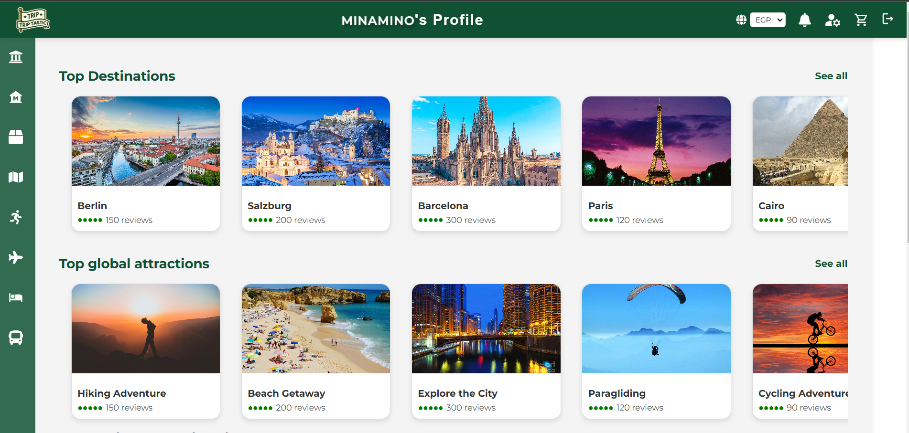
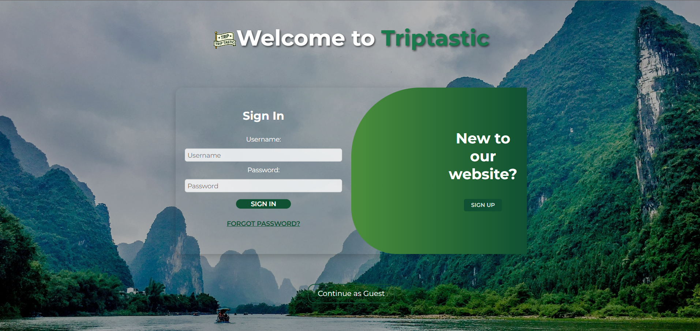

# Triptastic

*A platform to help tourists plan their travels by booking flights, accommodations, transportation, and activities. Additionally, it allows sellers and advertisers to post their offers and products for tourists to book.*

## Motivation

*Travel planning can be overwhelming, with tourists needing to coordinate flights, accommodations, transportation, and activities while managing multiple platforms. Similarly, sellers and advertisers in the tourism industry often struggle to reach potential customers in a crowded market. This project aims to simplify the travel planning process by offering a one-stop platform for tourists to book all aspects of their trip, while also providing an easy way for sellers to connect with travelers and promote their offers. By bringing everything into a single platform, we can enhance user experience and create new opportunities for both tourists and vendors.*

## Build Status

- Build Status is of this project is **IN PROGRESS**
- Known Issues: *Response time is a little bit slow possibly due to amount of requests sent to the server also UI/UX could still be improved. Some minor changes to the overall logic of some functions may need fine tuning*

- Last Updated: 9/12/2024


## Code Styles 

### Naming Conventions
- Camel Case for Variables and Functions
  - `loginTourist`, `createTourist`, `generateOTP`
- Consistent Capitalization in Model Imports
  - `const touristModel = require('../Models/Tourist.js')`
- Descriptive and Meaningful Variable Names
  - Clear naming that indicates purpose: `Username`, `Email`, `DOB`

### General guidelines
  - Always handle errors with meaningful messages. Use try-catch blocks for asynchronous code.
  
  - Functions should be defined as const to ensure they are not reassigned, maintaining consistency and avoiding accidental errors. 


## Screenshots





## Tech/Framework Used

- **MongoDB**  
  MongoDB is a NoSQL database that stores data in a flexible, JSON-like format. It is highly scalable, making it ideal for applications that require handling large volumes of data with varying structures.

- **Express.js**  
  Express.js is a fast Node.js web application framework designed to build network applications quickly and efficiently, offering a minimal set of features for routing and middleware.

- **React.js**  
  React.js is a JavaScript library for building user interfaces, particularly single-page applications, with a component-based architecture for reusable UI elements and efficient rendering.

- **Node.js**  
  Node.js is a runtime environment that enables JavaScript execution on the server side, known for its event-driven, non-blocking I/O, making it perfect for building scalable, high-performance applications.


## Features

- Flight Booking
- Hotel Booking
- Activity and Itinerary booking
- Product Buying and Selling
- Transportation Booking
- Advertising activities
- Posting historical sites


## Code Examples

### 1. **Tourist creation**
This example shows how to create a new tourist.
```javascript
const createTourist = async (req, res) => {
  const { Username, Email, Password, Nationality, DOB, Occupation, showIntro } = req.body;

  try {
    const userExistsInTourist = await touristModel.findOne({ Username });
    const userExistsInTourGuide = await tourGuideModel.findOne({ Username });
    const userExistsInAdvertiser = await advertiserModel.findOne({ Username });
    const userExistsInSeller = await sellerModel.findOne({ Username });
    const userExistsInAdmin = await adminModel.findOne({ Username });
    const userExistsInTourismGov = await tourismGovModel.findOne({ Username });

    if (userExistsInTourist || userExistsInTourGuide || userExistsInAdvertiser || userExistsInSeller || userExistsInAdmin || userExistsInTourismGov) {
      return res.status(400).json({ error: 'Username already exists.' });
    }

    const hashedPassword = await bcrypt.hash(Password, 10);

    const tourist = await touristModel.create({
      Username,
      Email,
      Password: hashedPassword,
      Nationality,
      DOB,
      Occupation,
      showIntro
    });

    res.status(200).json({
      message: 'Tourist registered successfully',
      tourist,
    });
  } catch (error) {
    res.status(400).json({ error: error.message });
  }
};
```


### 2. **Adding a new product**
This example shows how to add a new product to the website.

 ```javascript
 const createProductseller = async (req, res) => {
  const { productName,description,price,rating,seller,review,stock } = req.body;
  const image = req.file ? req.file.path : null;
  try {
    const product = await productModel.create({ productName,description,price,rating,seller,review,stock,image });
    res.status(201).json(product);
  } catch (error) {
    res.status(400).json({ error: error.message });
  }
};
```
### 3. **Fetching itineraries**
This example shows how itineraries get fetched in the frontend.
```javascript
  const fetchASCItineraries = async () => {
    try {
      const response = await fetch(`http://localhost:8000/sortItinPASC`, {
        method: 'GET',
        headers: {
          'Content-Type': 'application/json',
        },
      });

      if (response.ok) {
        const data = await response.json();
        const filteredItineraries = data.filter(itinerary => !itinerary.FlagInappropriate && itinerary.active);
        setItineraries(filteredItineraries);
        setErrorMessage('');
      } else {
        throw new Error('Failed to fetch itineraries');
      }
    } catch (error) {
      setErrorMessage('An error occurred while fetching itineraries');
      console.error(error);
    } finally {
      setLoading(false);
    }
  };
  ```


## Installation

Follow these steps to set up the project locally:

1. **Clone the Repository**  
   First, clone the repository to your local machine using the following command:  
   ```bash
   git clone https://github.com/Advanced-computer-lab-2024/Triptastic
   ```
2. **Navigate to the Project Directory**
  After cloning, navigate into the project directory:

  ```bash
  cd Triptastic
  ```
3. **Install the necessary dependencies using npm**
  ```bash
  npm i
  ```
Now you will have installed the project along with its necessary dependancies
    


## API reference
### 1. **Amadeus API**
GET:https://test.api.amadeus.com/v2/shopping/flight-offers
GET:https://test.api.amadeus.com/v3/shopping/hotel-offers

### 2. **Google maps API**
https://maps.googleapis.com/maps/api/geocode/json

### 3. **Currency exchange API**
https://api.exchangerate-api.com/v4/latest


## Tests
*To test our website functionality we used Postman to test all routes below you will find some example routes that were tested please make sure to examine the route itself to see if there is need for a body or query*

POST:http://localhost:8000/createProductseller

GET:http://localhost:8000/filterItineraries?minBudget=50&maxBudget=3500

PATCH:http://localhost:8000/addProductToWishlist

PATCH:http://localhost:8000/updateProductQuantityInCart

GET:http://localhost:8000/getPreferences?username=${username}


## How to Use
1. **Set Up Environment Variables**
   Create a .env and add the uri to your mongo cluster and any API keys you will need
2. **Run the Application**  
   To run this application after you have installed all necessary dependancies you need to open 2 terminals in the first one you will run the server by running 
   ```bash
   cd backend
   ```
   ```bash
   nodemon server.js
   ```
   Then in the 2nd terminal to run the application itself run
   ```bash
   cd frontend
   ```
   ```bash
   npm start
   ```
   you should now have the application up and running you can test all different functionalities like signing up logging in booking flights etc.


## Contribute
We welcome contributions from the community! Whether you want to fix a bug, add a new feature, or improve the documentation, your help is appreciated.
### How to Contribute
- **Create a New Branch**: Always create a new branch for each feature or bug fix you work on.
- **Submit a Pull Request**: Once you've made your changes, submit a pull request to the main repository. Make sure to include a clear description of your changes.


## Credits
https://www.youtube.com/channel/UC29ju8bIPH5as8OGnQzwJyA

https://www.youtube.com/channel/UCW5YeuERMmlnqo4oq8vwUpg   


## License

Apache License 2.0

Copyright [2024] [Triptastic]

Licensed under the Apache License, Version 2.0 
you may not use this file except in compliance with the License.
You may obtain a copy of the License at

    http://www.apache.org/licenses/LICENSE-2.0

Unless required by applicable law or agreed to in writing, software
distributed under the License is distributed on an "AS IS" BASIS,
WITHOUT WARRANTIES OR CONDITIONS OF ANY KIND, either express or implied.
See the License for the specific language governing permissions and
limitations under the License.

